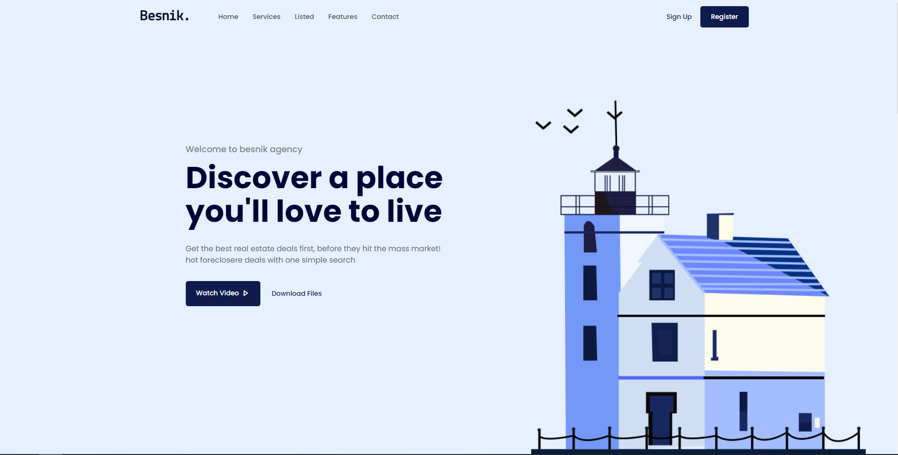

# FrontEnd3
UI/UX

## Práctica de diseño

Diseño de **Coder Mj** del tutorial en youtube  [Link](https://www.youtube.com/watch?v=akFPxiqTDWw&list=WL&index=5&t=82s&ab_channel=CoderMj) .

* [ ] HTML
* [ ] CSS
* [ ] Js
* [ ] Responsive

[Link](https://hydr0bius.github.io/coming-soon/) de la página.

 La portada de la página queda de la siguiente manera:

